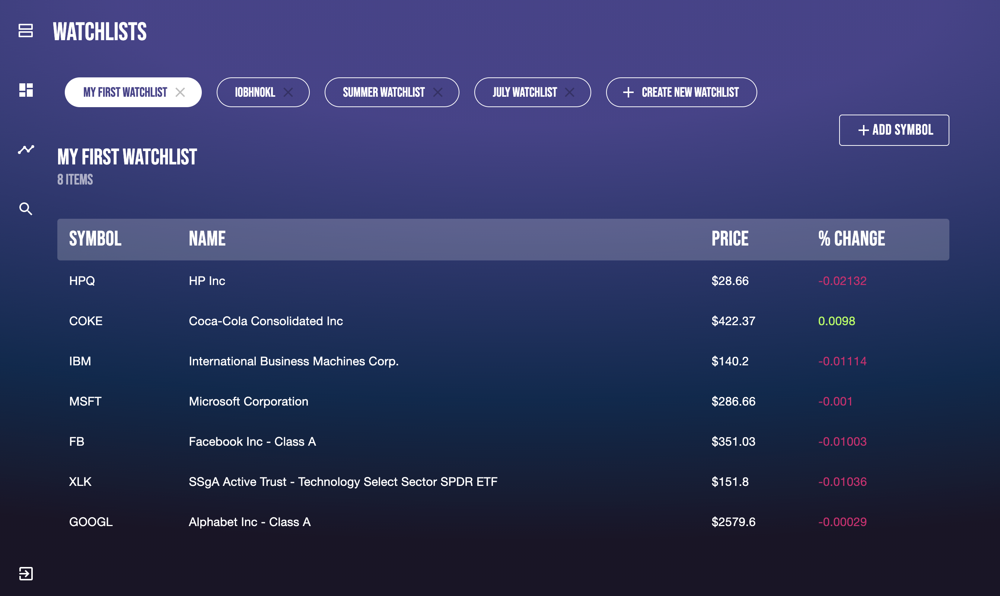

 

  <h1 align="center">Stock Market Tracker</h1>

  

    A React - Redux - TypeScript application that allow users to sign up and create watchlists for stocks and view real time intraday and historical data. This project is using the <a href="https://iexcloud.io/">IEX Cloud Financial Data APIs</a> to access live and historical data on stocks. The <a href='https://github.com/XandraV/stock-market-tracker-backend'>backend</a> is built with Node.js using JSON Web Tokens to authenticate users and a Mongodb database to store data.
     
     
    <a href="https://master.dn1vt8xnffhrx.amplifyapp.com/">View Deployed App</a> 
  

## Installation

Clone the master branch and then run following scripts in the project directory:

- `npm install` - to install relevant dependencies

- `npm start` - to start the react app

### Built With

## Resources

| Description                                                        | Link                                                                      |
| :----------------------------------------------------------------- | :------------------------------------------------------------------------ |
| Highcharts - charting library | [highcharts](https://www.highcharts.com/) |
| Highcharts-React - official Highcharts wrapper for React | [highcharts-react](https://github.com/highcharts/highcharts-react) |
| Material-UI components - a popular React UI framework              | [Material-UI docs](https://material-ui.com/getting-started/installation/) |
| Library that utilises tagged template literals to style React components | [styled components](https://styled-components.com/)                       |
| React Redux        | [react-redux](https://react-redux.js.org/)|
| React - JavaScript library for building user interfaces            | [create-react-app](https://github.com/facebook/create-react-app)|
|AWS Amplify |  [Amplify](https://aws.amazon.com/amplify/)
